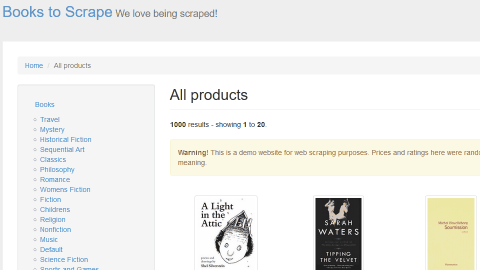

# A PROPOS

**OpenClassrooms - Développeur d'application Python - Projet #2: Utilisez les bases de Python pour l'analyse de marché**

_Testé sous Windows 10 et Python 3.10.2_

# Preview

# Objectifs
Le programme est un "scraper", il a pour but de récupérer des informations de tous les livres du site [books.toscrape.com](http://books.toscrape.com) et de les organiser (en les enregistrant dans des dossiers, sous-dossiers, etc.).
Chaque dossier correspond à une catégorie, laquelle contient un dossier "Books Covers" dans lequel sont téléchargées les images des couvertures des livres, et un fichier CSV (dont le nom est le même que la catégorie) qui contient les informations de chaque livre (nom, description, etc.).

# Comankonfè (Windows)
### Récupération d'une copie du "dépôt"

- `git clone https://github.com/munchou/OpenClassrooms-Project-2.git`

### Création et activation de l'environnement virtuel
(Python doit avoir été installé)
(Un casque VR n'est pas nécessaire. Ca n'a en fait aucun rapport)

- `python -m venv DOSSIER` où DOSSIER est le nom du dossier où sera créé l'environnement.
- Activation : `env\Scripts\activate`
    
### Installation des modules nécessaires

- `pip install -r requirements.txt`

### Yapluka

- `python bookscraper.py`

Si tout va bien, ça fonctionne. Temps estimé : entre 20 et 30 minutes. Oui, c'est long...
Goodie : une fois tout le processus terminé, le programme va générer un fichier texte "elapsed_time.txt" dans lequel sera inscrit le temps total.
Exemple : "The whole process took 27 minutes and 36.45 seconds."
C'est quand même cool, c'est cadeau.
